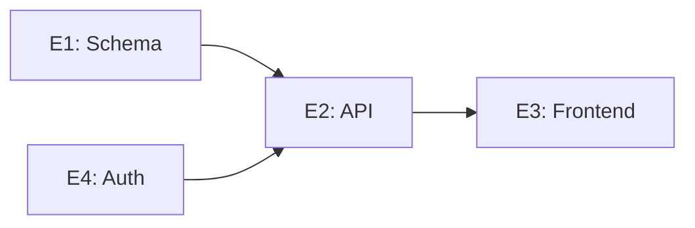

# Planning Artifact Formats

Concrete formats for deliverables in SKILL.md. Adapt columns to project.

## WBS

Hierarchical: Epic → Work Package → Task. Use numbers for stability.

```markdown
### E1. <Epic name> (source: <corpus file/section, or "derived from request">)
**Outcome:** <done state>

| # | Task | Owner (role) | Est. | Depends on | Notes |
|---|------|---|---|---|---|
| E1.1 | ... | Backend eng | 3d | — | |
| E1.2 | ... | Backend eng | 2d | E1.1 | |
```

Rules:
- Estimates: ranges/t-shirt sizes. No false precision.
- Dependencies: explicit `Depends on` for cross-team/service tasks.
- Owner: role/team.

## Milestone Roadmap

```markdown
| Milestone | Target | Exit criteria | Critical? |
|---|---|---|---|
| M1: Foundations | Wk 2 | Schema frozen, CI green | Yes |
| M2: Integration | Wk 5 | E2E happy path passes | Yes |
```

Anchor to verifiable exit criteria. Work backward from deadlines.

## Dependency Graph

Compact text/mermaid.



List **critical path** after graph.

## Risk Matrix

```markdown
| Risk | Likelihood | Impact | Area | Mitigation | Owner |
|---|---|---|---|---|---|
| Vendor API limits | Med | High | External | Load-test Wk 1 | Eng lead |
```

Likelihood/Impact: High/Med/Low. Sort by severity. Mitigation required.

## Assumptions Log

```markdown
| # | Assumption | Confidence | If wrong... |
|---|---|---|---|
| A1 | Payments API freeze | Low | M2 slips 2-3 wks |
```

Surface gaps from corpus.

## RACI

```markdown
| Work package | Responsible | Accountable | Consulted | Informed |
|---|---|---|---|---|
| E1 Schema | Backend eng | Eng lead | Data team | PM, stakeholders |
```

Skip for single-team/solo projects.